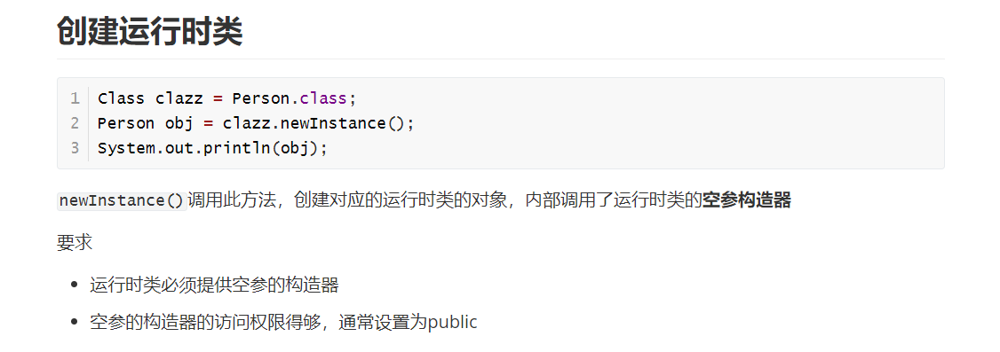

# Spring5入门

> https://repo.spring.io/release/org/springframework/spring/

1. 打开idea，创建java普通工程new -> project ->java ->next ->Create... ->next ->...

2. 导入jar包，libs ->把spring里对应的beans、context、core、expression包复制创建新文件夹

   然后是一个commons-logging的日志文件，我没找到，就直接拉了一个资料里对应的文件。

   复制5个jar包，直接在project目录下新建的lib文件夹Ctrl+V

   然后file -> Project Structure...->Modules -> + ->1 JARs or directories ->找到对应的5个完成导入

3. 创建普通类，普通的方法

   ```java
   public class User {
       public void add(){
           System.out.println("add......");
       }
   }
   ```

4.  创建Spring配置文件，在配置文件配置创建的对象 

   +  Spring配置文件使用xml格式 

     src 目录下新建xml文件

     ```xml
     <bean id ="user" class="spring5.User"></bean>
     ```

5.  进行测试代码编写 

   ```java
       @Test
       public void testAdd(){
           //1.加载spring配置文件
           ApplicationContext context = new ClassPathXmlApplicationContext("bean1.xml");
           //2 获取配置创建的对象
           User user = context.getBean("user", User.class);
           System.out.println(user);
           user.add();
       }
   ```

   > 一定要进行导入

#  IOC

1. 什么是IOC
   + 控制反转(Inversion of Control)，把**对象创建**和对象之间的**调用过程**，交给**Spring进行管理**
   + 使用IOC目的：为了耦合度降低
   + 做入门案例就是IOC实现
   
   > 如果要在一个类中调用另一个类中的函数，采用在该类中创建对象并调用方法是原始的方法并且耦合度太高。或者采用工厂模式，即新建工厂类，在类里get函数里return new 对象(所需要用的类的对象)，再在原来的类里通过工厂调用
   > 
   > UserDao dao = UserFactory.getDao();
   >
   > dao.add();
   
   > 用IOC配置的话
   >
   > 1. 先xml配置文件，配置要创建的对象
   >
   > <bean id = "dao" class = "路径.UserDao"></bean>
   >
   > 2. 有services类和dao类，创建工厂类
   >
   >    String classValue = class的属性值;//这一步是xml解析
   >
   >    //通过反射创建对象
   >
   >    Class clazz= Class.forName(类的全路径，即为classValue);
   >
   >    return (UserDao) clazz.newInstance();

2. IOC底层原理

+ xml解析、工厂模式、反射 

3. IOC(**BeanFactory** 接口)

   > 1. IOC 思想基于 IOC 容器完成，IOC 容器底层就是对象工厂 
   >
   > 2. Spring 提供 IOC 容器实现两种方式：（两个接口） 
   >
   >    + BeanFactory：IOC 容器基本实现，是 Spring 内部的使用接口，不提供开发人员进行使用
   >
   >      **加载配置文件时候不会创建对象，在获取对象（使用）才去创建对象** 
   >
   >    + ApplicationContext：BeanFactory 接口的子接口，提供更多更强大的功能，一般由开发人员进行使用 
   >
   >      **加载配置文件时候就会把在配置文件对象进行创建**
   >
   >    一般来说都是使用第二种接口，因为直接把耗时的工作做完，这样响应快
   >
   >
   > 3. ApplicationContext 接口有实现类
   >
   >    选中ApplicationContext然后Ctrl+H，可以看到具体的实现类
   >
   >    FileSystemXMLApplicationContext
   >
   >    ClassPathXmlApplicationContext

   

# Bean管理

1. Bean管理含义：表示两个操作
   + Spring创建对象
   + Spring注入属性
2. Bean管理的操作
   + 基于xml配置文件方式实现
   + 基于注解方式实现

## xml方式

1. 基于xml方式创建对象

   ```xml
<bean id ="user" class="spring5.User"></bean>
   ```

   + 在 spring 配置文件中，使用 bean 标签，标签里面添加对应属性，就可以实现对象创建 
+ 在 bean 标签有很多属性，介绍常用的属性 
  
  + id 属性：获取对象的唯一标识 
  
   + class 属性：创建类全路径（包类路径）
     
     + name属性：与id属性的区别是可以加特殊符号比如"/"
     
   + 创建对象时候，默认也是执行无参数构造方法完成对象创建
  
      (很好，对上了)
  
2. 基于xml方式注入属性

   + DI：依赖注入，就是注入属性(DI是IOC的一种具体实现)

     1. 使用set方法进行注入

        + 创建类，定义属性和对应的 set 方法 

          ```java
              //这个是set方法注入属性
              //创建属性
              private String bname;
              private String bauthor;
              //创建属性对应的set方法
              public void setBname(String bname) {
                  this.bname = bname;
              }
              public void setBauthor(String bauthor) {
                  this.bauthor = bauthor;
              }
          ```

        + 在 spring 配置文件配置对象创建，配置属性注入 

          ```xml
              <bean id="book" class="spring5.testdemo.Book" >
                  <!--  使用property完成属性注入
                      name：表示类里面属性的名称
                      value：表示向属性注入的值
                  -->
                  <property name="bauthor" value="2333"></property>
                  <property name="bname" value="QAQ"></property>
              </bean>
          ```
     
          
     
     2. 有参构造输入
     
        + 创建类，定义属性，创建属性对应有参数构造方法
     
          ```java
          /**
           * 这个是采用有参构造注入属性
           */
          public class Orders {
          
              private String oname;
              private  String oaddress;
          
              public Orders(String oname, String oaddress) {
                  this.oname = oname;
                  this.oaddress = oaddress;
              }
          
          }
          ```
     
        + 在 spring 配置文件中进行配置
     
          ```xml
              <!--这个是有参构造注入属性-->
              <bean id="orders" class="spring5.Orders"><!--这里一开始会报错，是因为它一开始是默认无参构造，但是这里是有参构造，需用constructor-arg标签-->
                  <constructor-arg name="oname" value="asf"></constructor-arg>
                  <constructor-arg name="oaddress" value="Beijing"></constructor-arg>
          
              </bean>
          ```
     
          > ps:
          >
          > <constructor-arg>标签里还有一个index属性，表示索引值，value设为0表示为第一个参数
        
     3. p名称空间注入
     
        使用 p 名称空间注入，可以简化基于 xml 配置方式 
     
        + 添加 p 名称空间在配置文件中
     
          > xmlns:p="http://www.springframework.org/schema/p"记得先加上这个
          >
          > 用来在配置文件中加入p名称空间
          
        + 属性注入
          
          ```xml
              <!--    set方法注入属性-->
              <bean id="book" class="spring5.Book" p:bname="神秘力量" p:bauthor="001">
              </bean>
          ```
     
     4. 注入其他类型属性(特殊字符和空值)
     
        1. 字面量：在类里面为属性设置的固定值就是字面量
     
           空值
     
           ```xml
                   <property name="address">
                       <null/>
                   </property>
           ```
     
           特殊字符：这个可以参考html01.md里面的实体(转义字符串)
     
           另外如果属性值包含特殊字符一是可以选择转义，二是选择把带特殊符号的内容写在CDATA里面
     
           ```xml
                   <property name="address">
                       <value><![CDATA[厉害厉害]]>
                       </value>
                   </property>
           ```
     
           > 注意：在idea里面直接输入CD加回车即可直接调出<![CDATA[]]>
           >
           > 此外，个人还发现<![CDATA[]]>放在value标签里面时，<![CDATA[]]>前面如果有空格，输出的时候也会有空格，如果有换行，输出的时候也会有换行
     
        2. 注入属性—外部Bean
     
           创建两个类 service 类和 dao 类 
     
           在 service 调用 dao 里面的方法 
     
           ```java
               //先是创建UserDao属性，生成对应的set方法
               private UserDao userDao;
               public void setUserDao(UserDao userDao){
                   this.userDao = userDao;
               }
               public void add(){
                   System.out.println("service add .....");
                   userDao.update();
               }
           ```
           
           在 spring 配置文件中进行配置 
           
           ```xml
               <!--创建service和dao的对象-->
               <bean id="UserService" class="spring5.service.UserService">
                   <!--注入UserDao属性
                   name：表示类里面的属性名称
                   ref：创建UserDao对象bean标签id值
                   因为是注入对象，所以是用ref
                   -->
                   <property name="userDao" ref="UserDaoImpl"></property>
               </bean>
               <bean id="UserDaoImpl" class="spring5.dao.UserDaoImpl"></bean>
           ```
           
        3. 注入属性—内部Bean和级联赋值
        
           创建两个类，Dept和Emp
           
           ```java
           //部门类
           public class Dept {
               private String dname;
               public void setDname(String dname) {
               this.dname = dname;
               }
           }
           //员工类
           public class Emp {
               private String ename;
               private String gender;
               //员工属于某一个部门，使用对象形式表示
               private Dept dept;
               public void setDept(Dept dept) {
               this.dept = dept;
               }
               public void setEname(String ename) {
               this.ename = ename;
               }
               public void setGender(String gender) {
               this.gender = gender;
               }
           }
           ```
           
           在 spring 配置文件中进行配置
           
           ```xml
           <!--内部 bean-->
           <bean id="emp" class="com.atguigu.spring5.bean.Emp">
               <!--设置两个普通属性-->
               <property name="ename" value="lucy"></property>
               <property name="gender" value="女"></property>
               <!--设置对象类型属性-->
               <property name="dept">
                   <bean id="dept" class="com.atguigu.spring5.bean.Dept">
                       <property name="dname" value="安保部"></property>
                   </bean>
               </property>
           </bean>
           ```
           
        4. 注入属性—级联赋值
        
           ```xml
               <!--级联赋值-->
               <bean id="emp" class="spring5.bean.Emp">
                   <!--这是两个普通属性-->
                   <property name="ename" value="lucy"></property>
                   <property name="gender" value="女" ></property>
                   <!--级联赋值-->
                   <property name="dept" ref="dept"></property>
                   <property name="dept.dname" value="技术部"></property>
                   <!--这里是直接对dept这个类属性里面的dname进行赋值，如果你不设置dname的get方法，就会报错-->
               </bean>
               <bean id = "dept" class="spring5.bean.Dept">
                   <property name="dname" value="财务部"></property>
               </bean>
           ```
        
        5. 注入属性---集合属性
        
           创建类，定义数组、list、map、set、类型属性，生成对应的set方法
        
           ```java
           public class Stu {
               //1.数组类型属性
               private String[] courses;
               //2.list集合类型属性
               private List<String> list;
               //3.map集合类型属性
               private Map<String,String> maps;
               //4.set集合类属性
               private Set<String> sets;
           
               public void setCourses(String[] courses) {
                   this.courses = courses;
               }
               public void setList(List<String> list) {
                   this.list = list;
               }
               public void setMaps(Map<String, String> maps) {
                   this.maps = maps;
               }
               public void setSets(Set<String> sets) {
                   this.sets = sets;
               }
           }
           ```
           
           在Spring配置文件进行配置
           
           ```xml
               <bean id="stu" class="spring5.collectiontype.Stu">
                <!--数组类型属性注入-->
                   <property name="courses">
                       <array>
                           <value>java课程</value>
                           <value>数据库课程</value>
                       </array>
                   </property>
                   <!--list类型属性注入-->
                   <property name="list">
                       <list>
                           <value>张三</value>
                           <value>小三</value>
                           <value>法外狂徒</value>
                       </list>
                   </property>
                   <!--map类型属性注入-->
                   <property name="maps">
           
                       <map>
                           <entry key="JAVA" value="java"></entry>
                           <entry key="PHP" value="php"></entry>
                       </map>
                   </property>
                   <!--set类型属性注入-->
                   <property name="sets">
           
                       <set>
                           <value>MySQL</value>
                           <value>Redis</value>
                       </set>
                   </property>
               </bean>
           ```
        
            在集合里面设置对象类型值
        
           ```xml
                   <!--注入List集合类型，值是对象-->
                   <property name="courseList">
                       <list>
                           <ref bean="course1"></ref>
                           <ref bean="course2"></ref>
                       </list>
                   </property>
               </bean>
           
               <bean id="course1" class="spring5.collectiontype.Course">
                   <property name="cname" value="Spring5框架"></property>
               </bean>
               <bean id="course2" class="spring5.collectiontype.Course">
                   <property name="cname" value="MyBatis框架"></property>
               </bean>
           ```
        
           把集合注入部分提取出来
        
           + 在Spring配置文件中引入名称空间util
           
             ```xml
             xmlns:util="http://www.springframework.org/schema/util"
             xsi:schemaLocation="http://www.springframework.org/schema/beans http://www.springframework.org/schema/beans/spring-beans.xsd
                                        http://www.springframework.org/schema/util http://www.springframework.org/schema/util/spring-util.xsd">
             ```
           
           + 使用util标签完成list集合注入提取
           
             ```xml
             <!--1 提取list集合类型属性的注入--><util:list id="bookList">
                 <value>易筋经</value>
                 <value>简简单单</value>
                 <value>随随便便</value>
             </util:list>
             <!-- 2. 提取list集合类型属性注入使用-->
             <bean id="book" class="spring5.collectiontype.Book">
                 <property name="list" ref="bookList"></property>
             </bean>
             ```

##  IOC操作Bean管理（FactoryBean） 

1. Spring 有两种类型 bean，一种普通 bean，另外一种工厂 bean（FactoryBean
2. 普通 bean：在配置文件中定义 bean 类型就是返回类型 
3. 工厂 bean：在配置文件定义 bean 类型可以**和返回类型不一样**
   + 创建类，让这个类作为工厂 bean，实现接口 FactoryBean
   + 实现接口里面的方法，在实现的方法中定义返回的 bean 类型 

```java
public class MyBean implements FactoryBean {
    @Override
    public Course getObject() throws Exception {
        Course course = new Course();
        course.setCname("abdc");
        return course;
    }
    @Override
    public Class<?> getObjectType() {
        return null;
    }
    @Override
    public boolean isSingleton() {
        return false;
    }
}
//测试类
    @Test
    public void test3(){
        ApplicationContext context = new ClassPathXmlApplicationContext("bean7.xml");
        Course course = context.getBean("myBean",Course.class);
        System.out.println(course);
    }
//配置文件
    <bean id="myBean" class="spring5.factorybean.MyBean">
    </bean>
```

## IOC操作Bean管理（Bean作用域）

1. 在 Spring 里面，设置创建 bean 实例是单实例还是多实例 

2.  在 Spring 里面，默认情况下，bean 是单实例对象 

   > 可以获取两个对象，然后再输出其地址，比较地址是否相同

3. 如何设置单实例还是多实例 

   +  在spring配置文件bean标签里属性（scope）

   +  scope 属性值

     + 默认值，singleton，单实例对象

     + prototype，多实例对象

   + singleton 和 prototype 区别
     + singleton 单实例 prototype 多实例
     + singleton时，加载 spring 配置文件时候就创建单实例对象
       prototype时，在调用getBean 方法时候创建多实例对象

## IOC操作Bean管理（Bean生命周期）

1. 生命周期 ：从对象创建到对象销毁的过程 

2.  bean 生命周期

   + 通过构造器创建 bean 实例（无参数构造）
   + 为 bean 的属性设置值和对其他 bean 引用（调用 set 方法）
   + 调用 bean 的初始化的方法（需要进行配置初始化的方法）
   + bean 可以使用了（对象获取到了）
   + 当容器关闭时候，调用 bean 的销毁的方法（需要进行配置销毁的方法） 

3.  演示 bean 生命周期

   ```java
   public class Orders {
       private String oname;
   
       public Orders() {
           System.out.println("第一步 执行无参数构造创建 bean 实例");
       }
       public void setOname(String oname) {
           this.oname = oname;
           System.out.println("第二步 调用 set 方法设置属性值");
       }
       //创建执行的初始化的方法
       public void initMethod() {
           System.out.println("第三步 执行初始化的方法");
       }
       public void destroyMethod(){
           System.out.println("第五步，执行销毁的方法");
       }
   }
   //配置文件
       <bean id="Orders" class="spring5.bean.Orders" init-method="initMethod" destroy-method="destroyMethod">
           <property name="oname" value="手机" ></property>
       </bean>
   //测试方法
       @Test
       public void testBean3() { 
           ApplicationContext context = new ClassPathXmlApplicationContext("bean8.xml");
           Orders orders = context.getBean("Orders", Orders.class);
           System.out.println("第四步 获取创建 bean 实例对象");
           System.out.println(orders);
           //手动让 bean 实例销毁
           ((ClassPathXmlApplicationContext)context).close();
       }
   ```

4. bean 的后置处理器，bean 生命周期有七步 

   + 通过构造器创建 bean 实例（无参数构造）
   + 为 bean 的属性设置值和对其他 bean 引用（调用 set 方法）
   + **把 bean 实例传递 bean 后置处理器的方法 postProcessBeforeInitialization**
   + 调用 bean 的初始化的方法（需要进行配置初始化的方法）
   + **把 bean 实例传递 bean 后置处理器的方法 postProcessAfterInitialization**
   + bean 可以使用了（对象获取到了） 
   + 当容器关闭时候，调用 bean 的销毁的方法（需要进行配置销毁的方法） 

   ```java
       @Override
       public Object postProcessBeforeInitialization(Object bean, String beanName) throws BeansException {
           System.out.println("在初始化之前执行的方法");
           return bean;
       }
       @Override
       public Object postProcessAfterInitialization(Object bean, String beanName) throws BeansException {
           System.out.println("在初始化之后执行的方法");
           return bean;
       }
   //xml配置
       <!--配置后置处理器-->
       <bean id="myBeanPost" class="spring5.bean.MyBeanPost"></bean>
   ```

##  IOC操作Bean管理（xml自动装配） 

1. 什么是自动装配 

   根据指定装配规则（属性名称或者属性类型），Spring 自动将匹配的属性值进行注入  

   bean标签属性 autowire，根据值的不同自动装配

   + byName根据属性名称注入 ，注入值 bean 的 id 值和类属性名称一样
   + byType 根据属性类型注入  

2.  演示自动装配过程 

   + 根据属性名称自动注入 

     ```xml
     <bean id="emp" class="spring5.autowrite.Emp" autowire="byName">
         <!--<property name="dept" ref="dept"></property>-->
     </bean>
     <bean id="dept" class="spring5.autowrite.Dept"></bean>
     ```

   + 根据属性类型自动注入 

     ```xml
     <bean id="emp" class="spring5.autowrite.Emp" autowire="byType">
         <!--<property name="dept" ref="dept"></property>-->
     </bean>
     <bean id="dept" class="spring5.autowrite.Dept"></bean>
     ```

## IOC操作Bean管理（引入外部属性文件） 