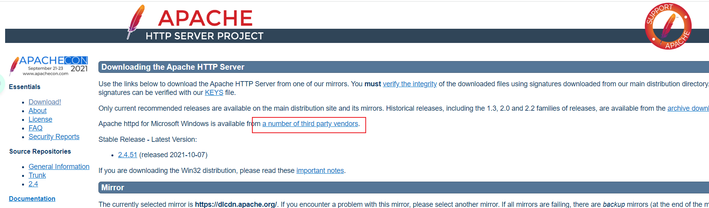
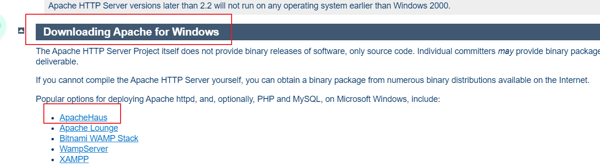
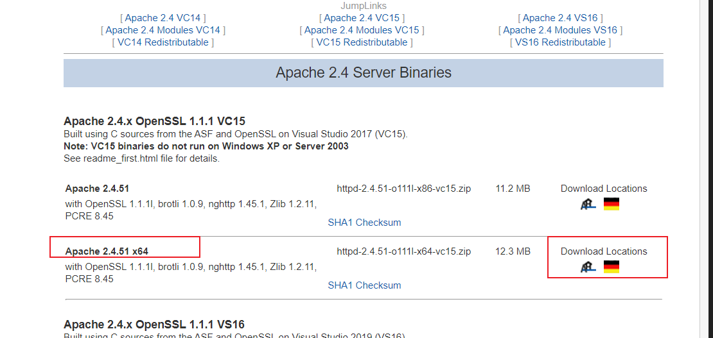
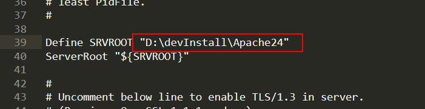
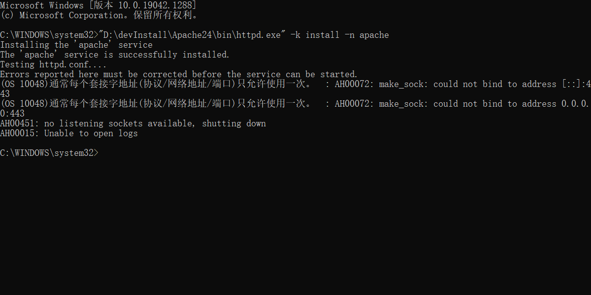
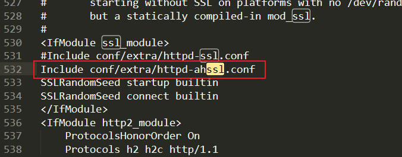
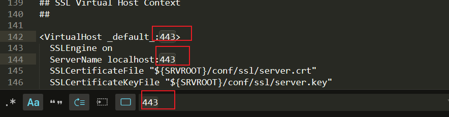

# Apache的下载安装

1. 进入官网http://httpd.apache.org/download.cgi

2. 点击  a number of third party vendors 

   

3.  找到Downloading Apache for Windows

   点击ApacheHaus链接

   

4. 选择x64，下载

   

5.  保存到想要保存的位置，解压压缩包

6.  打开httpd.conf文件(D:\devInstall\Apache24\conf路径下)

   修改Apache安装目录 

   

7. 管理员身份cmd，然后

   ```"D:\devInstall\Apache24\bin\httpd.exe" -k install -n apache```

   

8. 出现了一旦问题，端口占用

9. 进入```D:\devInstall\Apache24\logs``` ，打开日志文件install.log，查看443，发现是ssl端口

   再进入```D:\devInstall\Apache24\conf``` ，打开 httpd.conf ，查找ssl，

    

   发现引用了httpd-ahssl.conf文件，打开那个文件，查找443

   

   

   全部更改为442，保存退出

10. 本来啊，依照教程本来该

    ```
    卸载:
    	httpd -k uninstall
    安装:
    	httpd -k install
    ```

    诶嘿，但是呢，又出bug了，卸载出了问题，它找不到卸载对象。。。

11. 最后的最后，我进服务里面刷新了一下，它居然又能用了！

    