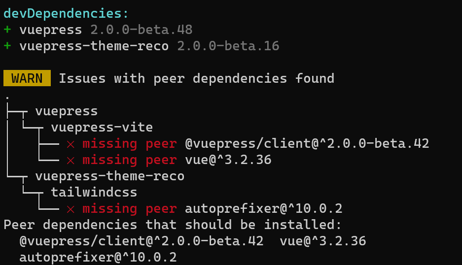
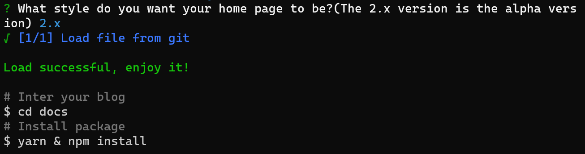

本篇主要讲述2.0的安装与使用

# 安装

> ps：前置需求，比如node、yarn、npm这里就不提了直接进入vuepress2的安装使用

我们可以打开http://v2.vuepress-reco.recoluan.com/来查看vuepress2的指南

1. 下载

   ```
   npm install @vuepress-reco/theme-cli@1.0.7 -g
   ```

   下载完成之后可能会提示你文件不完整

   

   直接按照提示信息进行下载即可

   ```
   pnpm install @vuepress/client@^2.0.0-beta.42
   pnpm install autoprefixer@^10.0.2
   pnpm install postcss@^8.1.0
   pnpm install vue@^3.2.36
   ```

   > ps：使用npm也可以，不过pnpm类似于npm的进阶版，需要下载，此处暂且不提

   完成之后即可进行安装使用了

2. 安装使用

   ```
   theme-cli init
   ```

   然后就会引导你进行创建

   分别提问是否创建新仓库(默认是)、(如果是，则提问仓库名是什么、)项目标题是什么、项目描述是什么，作者名字是什么、根据引导自行填写。

   随后选择2.x版本，成功之后就是这样

   

   **注意：这里需要保证你可以连接上github，如果连不上，请自行百度**

   ```
   pnpm install
   ```

# 个人配置

1. 生成pakage.