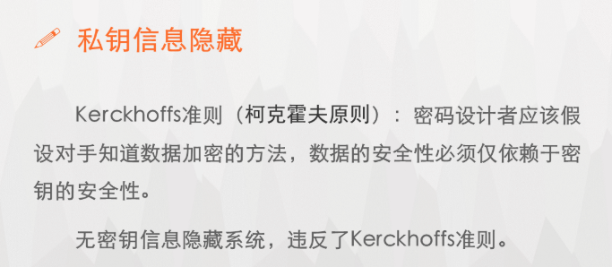
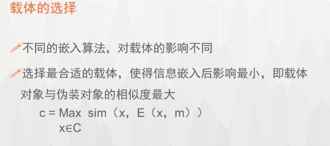
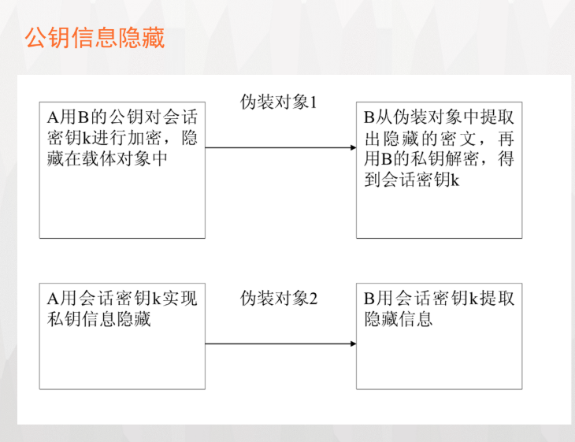

# 信息隐藏技术

定义：数据隐藏，将秘密信息隐藏于另一非保密的载体中

## 基本要求

+ 载体对象是正常的，不会引起怀疑
+ 伪装对象与载体对象无法区分，无论从感官上，还是从计算机的分析上
+ 不可视通信的安全性取决于第三方有没有能力将载体对象和伪装对象区别开
+ 对伪装对象的正常处理，不应破坏隐藏的信息

## 隐藏技术分类

1. 隐写术

   将重要的信息隐藏起来，以便不引起人注意地进行传输和存储

   主要分为语义隐写和技术隐写

2. 数字水印

   在原始数据中嵌入秘密信息----水印，证实该数据的所有权。可以是文字，标识，序列号，通常不可见或不可察。可以经历一些不破坏原数据使用价值或商用价值的操作，而能保存下来

3. 隐蔽信道

   允许进程以危害系统安全策略的方式传输信息的通信信道

   隐藏信道分析工作包括信道**识别**、**度量**、**处置** 

   + 信道识别：对系统的静态分析，抢到对设计和代码进行分析，发现所有潜在的隐藏信道
   + 信道度量：对信道的传输能力和威胁程度的评价
   + 信道处置：包括信道消除、限制、审计

4. 阈下信道

   指：在基于公钥密码技术的数字签名、认证等应用密码体制的输出密码数据中建立起来的一种隐蔽信道，除指定的接受者外，任何其他人均不知道密码数据中是否有阈下消息的存在

根据应用场合的不同要求，分为隐写术和数字水印两个主要分支。

+ **隐写术** 研究的重点是如何实现信息的伪装的隐蔽性

+ **数字水印** 需要考虑水印信息是否稳健等特征。如，对各种可能攻击的敏感性等。

根据隐藏协议，还可以分为无密钥信息隐藏、私钥信息隐藏、公钥信息隐藏

 

 

 

 

  

 

 

 

 

 

