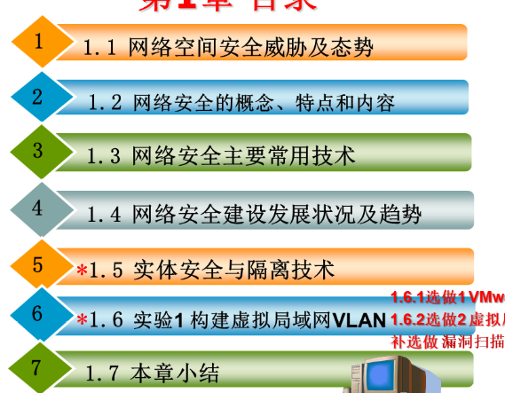
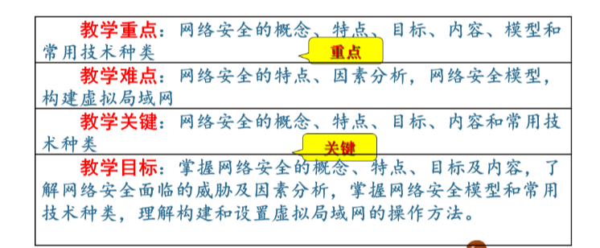

很好，这就是教材

线上课程网址:学堂在线-上海市高校精品课程/在线课程“网络安全技术”，网络课程网址为:
```https: //next.xuetangx.com/course/shdjc08091001895/1493977?fromArray=search_result```

主要学  这几章

# 第一章



 

网络空间存在的问题：

1. 法律法规、安全管理和意识欠缺
2. 政府以企业的侧重点和要求不一致
3. 网络安全规范和标准不统一
4. 网络系统的安全威胁及隐患

